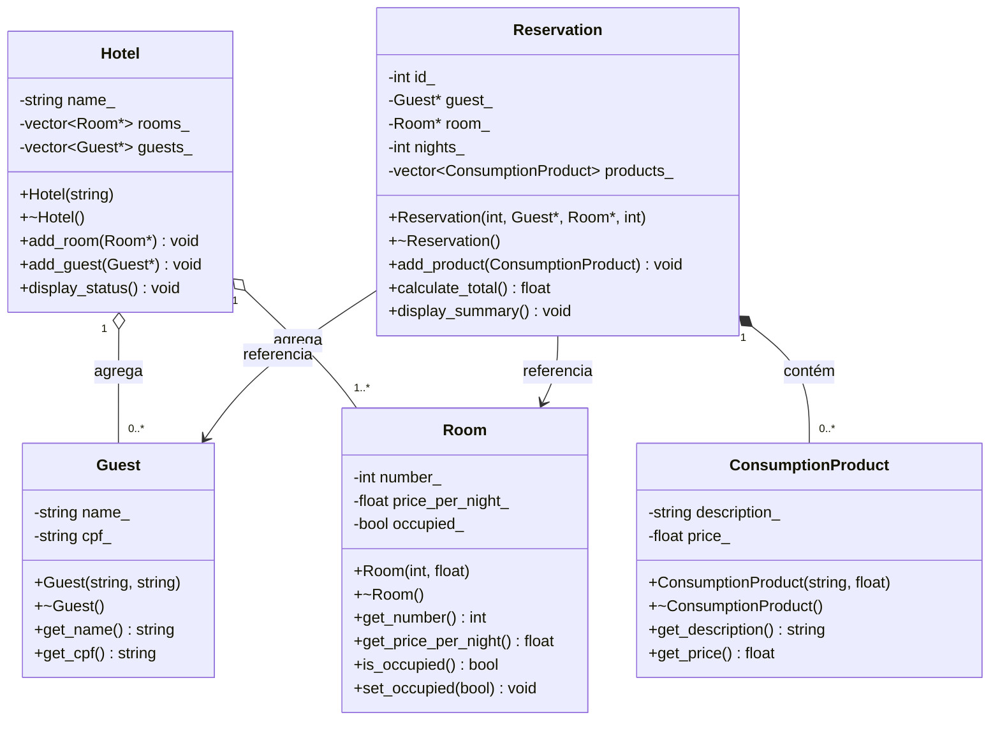

# Sistema de Hotel

**Nome:** Davidys Cavalcante de Pontes
**Matrícula:** 20250019035

## Descrição

Este projeto se resume a um sistema de gerenciamento de hotel. O hotel possui quartos que podem ser reservados por hóspedes, cada reserva pertence a um hóspede e a um quarto específico, e pode conter itens de consumo, como serviços adicionais. O sistema permite realizar reservas e calcular o valor total a pagar.

## Diagrama UML

